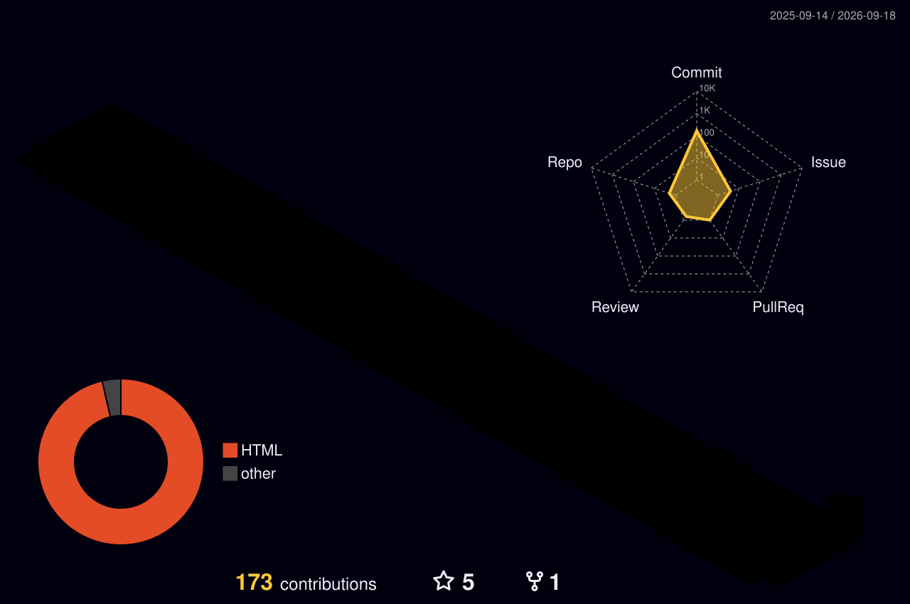

# Hi there, I'm Solomon Rajan 👋 

  

 

  

## 🙋‍♂️ About Me
- 👨🏽‍💻 Currently working my magic on [solomonrajan.github.io](https://github.com/solomonrajan/solomonrajan.github.io) 🪄
- 🌱 Learning Data Science (because who doesn't love staring at spreadsheets? 📊)
- 🤔 Looking for help with Website development in Material You Design (pls send help 😭)
- 💬 Ask me about anything, I'll pretend I know the answer! 🤓
- ⚡️ Fun-Fact: I'm a Plutonian Owl Lover. Yes, that's a thing! 🦉🪐

## 🛠️ Skills & Tools

  

## 🚀 Workspaces & Commit Status

<!-- START_COMMIT_TABLE -->
| 📁 Repository | 📝 Description | 🚀 Latest Commit |
| :--- | :--- | :--- |
| 🌐 **[solomonrajan.github.io](https://github.com/solomonrajan/solomonrajan.github.io)** | A hobby personal website *(Current working repo)* | `87ae2dc` - chore: update changelog [skip ci]  |
| 👤 **[solomonrajan](https://github.com/solomonrajan/solomonrajan)** | GitHub Profile Readme | `b003fd8` - Auto-update latest commit status  |
<!-- END_COMMIT_TABLE -->

## 📊 3D GitHub Stats

  

 

  
  

## 🏆 GitHub Achievements

  

## 📝 Blog Posts
<!-- BLOG-POST-LIST:START -->
<!-- BLOG-POST-LIST:END -->

## 🔗 Connect with me

  
  
  
  
  

 

  

## 💝 Support & Resume

  
    
  
  
  
  

